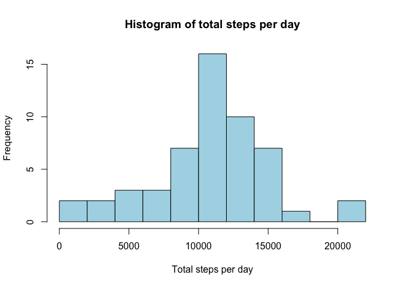
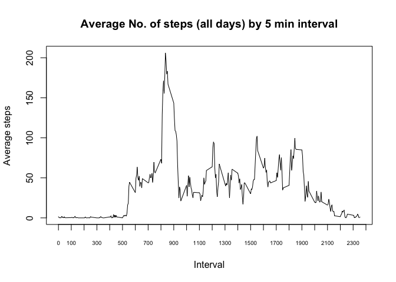
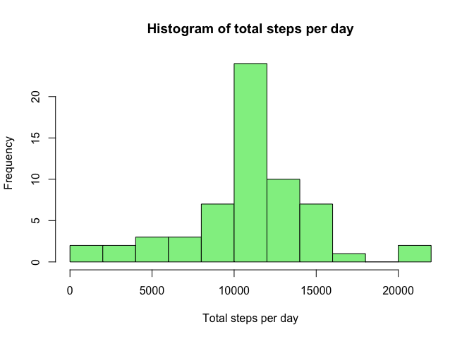
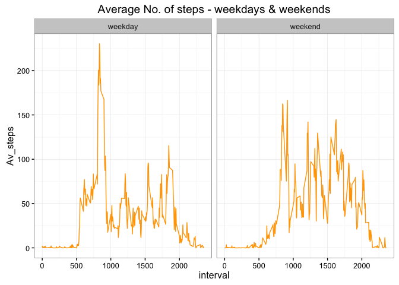

# PA1_template.Rmd
Richard Hunt  
13 May 2016  


```r
knitr::opts_chunk$set(echo = TRUE)
options(scipen = 2, digits = 0)
```

# Reproducible research
## Assignment 1
## Report on data sourced from activity monitoring device

This report has been prepared to share observations of chararterics and answer specific questions relating to the data.

### R packages used in this report and sessionInfo

The report requires the use of a number of R packages to be loaded to satisfactorliy complete the analysis.


```r
library(lattice)
library(dplyr)
library(ggplot2)
library(zoo)
library(lubridate)
```

In the interests of assisting in the reproducibility of this report here are some details about the environment used to produce this report:  


```r
sessionInfo()
```

```
## R version 3.2.3 (2015-12-10)
## Platform: x86_64-apple-darwin13.4.0 (64-bit)
## Running under: OS X 10.11.4 (El Capitan)
## 
## locale:
## [1] en_AU.UTF-8/en_AU.UTF-8/en_AU.UTF-8/C/en_AU.UTF-8/en_AU.UTF-8
## 
## attached base packages:
## [1] stats     graphics  grDevices utils     datasets  methods   base     
## 
## other attached packages:
## [1] lubridate_1.5.6 zoo_1.7-13      ggplot2_2.1.0   dplyr_0.4.3    
## [5] lattice_0.20-33
## 
## loaded via a namespace (and not attached):
##  [1] Rcpp_0.12.4      digest_0.6.9     assertthat_0.1   plyr_1.8.3      
##  [5] grid_3.2.3       R6_2.1.2         gtable_0.2.0     DBI_0.3.1       
##  [9] formatR_1.3      magrittr_1.5     scales_0.4.0     evaluate_0.8.3  
## [13] stringi_1.0-1    rmarkdown_0.9.5  tools_3.2.3      stringr_1.0.0   
## [17] munsell_0.4.3    parallel_3.2.3   yaml_2.1.13      colorspace_1.2-6
## [21] htmltools_0.3.5  knitr_1.12.3
```


### Data used for this analysis

The data used in this analysis has been collected from a personal actvity monitoring device. The data consists of observations of steps taken by an individual during the months of October and November 2012. These observations were taken at 5 minute intervals across each day of this period.

The data is stored in csv format within a zipped file downloaded to the working directory and will form the foundations of this analysis.


```r
unzip("repdata-data-activity.zip")
# read in csv file to dataframe
activity_data <- read.csv("activity.csv")
```

The variables included in this dataset are:  

* steps: Number of steps taking in a 5-minute interval (missing values are coded as NA)  

* date: The date on which the measurement was taken in YYYY-MM-DD format  

* interval: Identifier for the 5-minute interval in which measurement was taken  


### Mean total number of steps taken per day

We'll now transform the data to calculate total steps per day and display a frequency distribution using a histogram.


```r
# retain only those observations where no NA
activity_data_ignoreNAs <- filter(activity_data, steps != "NA")
# create dataframe summarising total steps per day
activty_data_perday <- activity_data_ignoreNAs %>% group_by(date) %>% summarise(Total_steps = sum(steps))
# create a histogram of total steps per day
hist(activty_data_perday$Total_steps, breaks = 10, main = "Histogram of total steps per day", xlab = "Total steps per day", col = "lightblue")
```



We'll calculate the mean and median for total steps per day


```r
mean_steps <- round(mean(activty_data_perday$Total_steps))
median_steps <- median(activty_data_perday$Total_steps)
```

The mean of the total steps per day is 10766  
The median of the total steps per day is 10765

### Average daily activity pattern

We'll now transform the data to calculate the average number of steps taken across each 5 minute interval.


```r
# create a dataframe summarising total steps per interval
activty_data_perinterval <- activity_data_ignoreNAs %>% group_by(interval) %>% summarise(Ave_steps = mean(steps))
# create a time series plot of average steps per interval over all days
plot(activty_data_perinterval$interval, activty_data_perinterval$Ave_steps, type = "l", main = "Average No. of steps (all days) by 5 min interval", , xaxt = "n", xlab = "Interval", ylab = "Average steps")
axis(1, at = seq(0, 2400, by = 100), cex.axis = 0.6)
```



We'll identify the 5-minute interval (on average across all the days in the dataset) which contains the maximum number of steps?


```r
activity_data_MaxSteps <- activty_data_perinterval[which.max(activty_data_perinterval$Ave_steps),]
```

The 5-minute interval with highest average number of steps is 835.

### Imputing missing values

There are a number of days/intervals in the activity data set where there are missing values (coded as 𝙽𝙰). The presence of missing days may introduce bias into some calculations or summaries of the data.

We will undertake some further analysis to report on missing values and implement a strategy to replace missing values with appropriate values and undertake some reporting on this complete data set.


```r
total_NAs<-sum(is.na(activity_data))
```

The total number of missing values in the dataset is 2304

It is considered a reasonable strategy to replace NA's with the mean for the corresponding 5-minute interval.


```r
# replicate the activity_data dataframe to be used for NA removal
activity_data_rep <- activity_data
# use Zoo package with ave & na.aggregrate functions to replace NA's with the mean for the corresponding 5-minute interval
activity_data_rep$steps <- ave(activity_data_rep$steps, activity_data_rep$interval, FUN=na.aggregate)
```

Lets plot a histogram of the total number of steps taken each day and calculate and report the mean and median total number of steps taken per day for the dataset where NA's were replaced.


```r
# create dataframe summarising total steps per day
activty_data_rep_perday <- activity_data_rep %>% group_by(date) %>% summarise(Total_steps = sum(steps))
# create a histogram of total steps per day
hist(activty_data_rep_perday$Total_steps, breaks = 10, main = "Histogram of total steps per day", xlab = "Total steps per day", col = "lightgreen")
```



We'll calculate the mean and median for total steps per day


```r
mean_steps_NAremoved <- round(mean(activty_data_rep_perday$Total_steps))
median_steps_NAremoved <- round(median(activty_data_rep_perday$Total_steps))
```

The mean of the total steps per day (NA's removed) is 10766  
The median of the total steps per day (NA's removed) is 10766

There is no material difference between the mean and median values reported earlier in the report where NA values were ignored and where NA values were replaced with the mean for the corresponding 5-minute interval.  

### Differences in activity patterns between weekdays and weekends

We'll compare the interval activity patterns across weekdays and weekends by categorising the dates in the data set by weekday or weekend and comparing the activity in some graphs.  


```r
# create a new factor variable for weekday and weekend
activity_data_rep$weekday <- factor(ifelse(wday(activity_data_rep$date) %in% 2:6, "weekday", "weekend"), levels = c("weekday", "weekend"))
activity_data_rep_weekdayOrEnd <- activity_data_rep %>% group_by(weekday, interval) %>% summarise(Av_steps = mean(steps))

# create a panel plot comparing weekdays and weekends
g <- ggplot(activity_data_rep_weekdayOrEnd, aes(interval, Av_steps))
g <- g + facet_grid(. ~ weekday)
g <- g + geom_line(col = "orange")
g <- g + labs(title = "Average No. of steps - weekdays & weekends")
g <- g + theme_bw()
g
```




#### Some general observations

In the absence of further information it is difficult to make any definitive observations although some generalisations may be offered including:  

* spike in early morning activity on weekdays may indicate work commute;  
* minimal activity across the mid-morning/afterroon on weekdays may indicate sedentary occupation;  
* relative to weekdays although wake-up times may be consistent it appears their may be a tendency to stay in the home longer before leaving for the day;  
* mid-morning weekend activity may indicate attendance at kids sports;
* relative to weekdays thier is more activity throughout the day.
